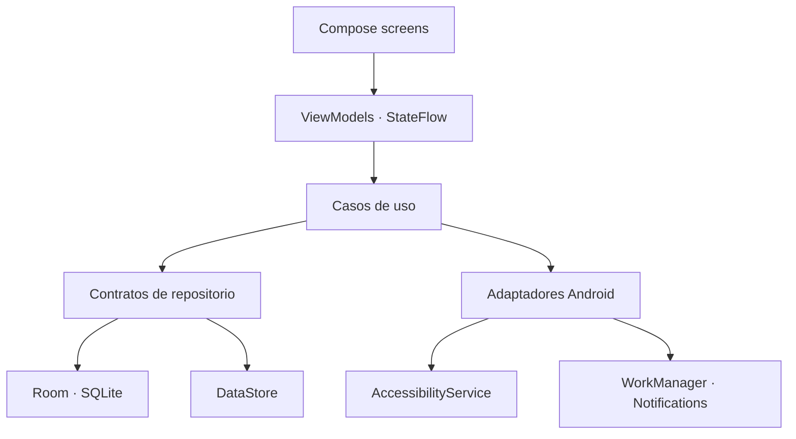

# Mind

Mind es una aplicación Android local que convierte tareas productivas en puntos consumibles. El usuario gana puntos al completar su plan y decide cuándo gastarlos para acceder temporalmente a aplicaciones que él mismo marcó como distractoras.

El objetivo no es prohibir el ocio ni construir un control parental: es introducir una pausa deliberada entre el impulso de abrir una aplicación y la decisión consciente de usarla.

> Estado: prototipo funcional de portafolio `0.1.0`. Las fases 0–11 están desarrolladas. La validación física en varios dispositivos continúa registrada en el [checklist de release](docs/RELEASE_CHECKLIST.md).

## Problema y propuesta


Una tarea planificada acredita puntos y XP una sola vez. Una compra descuenta puntos sin reducir XP y crea una sesión persistente. Cuando expira, el shield vuelve a proteger la aplicación.

## Capacidades

- planificación del día siguiente y reconciliación de días omitidos;
- tareas, saldo consumible, XP y ledger auditable;
- catálogo local de aplicaciones y tres tipos de regla;
- shield mediante `AccessibilityService`, sin polling agresivo;
- compras transaccionales protegidas frente a doble gasto concurrente;
- reto local y aplicación diferida de cambios permisivos;
- desbloqueo de emergencia deliberado, auditable y con penalización limitada;
- historial diario, resumen semanal y desglose por aplicación;
- recordatorio configurable con WorkManager y DataStore;
- temas System, Light y Dark con cuatro acentos;
- funcionamiento offline, sin cuentas, backend, publicidad ni analítica.

## Demo

El recorrido principal crea y completa una tarea de 30 puntos, configura una aplicación a 30 puntos por 5 minutos, muestra el shield, confirma la compra, permite la sesión, vuelve a bloquear al expirar y refleja todo en el historial.

El [guion de demostración](docs/DEMO_SCRIPT.md) contiene preparación, tomas y comandos de grabación. El repositorio no incluye una captura simulada: el material visual debe registrar el comportamiento real del servicio.

## Arquitectura



La lógica que decide puntos, compras, expiraciones, días y cambios de regla no vive en Compose ni en el servicio. El saldo, débito y sesión cambian dentro de una única transacción Room. Consulta [Arquitectura](docs/ARCHITECTURE.md) y los [ADRs](docs/adr/README.md).

## Stack

| Área | Tecnología |
|---|---|
| Lenguaje | Kotlin, coroutines y Flow |
| UI | Jetpack Compose, Material 3 y Navigation Compose |
| Presentación | ViewModel y StateFlow |
| Persistencia | Room y DataStore Preferences |
| Inyección | Hilt y KSP |
| Background | WorkManager |
| Protección | AccessibilityService y accessibility overlay |
| Pruebas | JUnit, Room in-memory, AndroidX Test y Compose UI Test |

Configuración: `minSdk 26`, `targetSdk 37`, Java 17, AGP 9.3 y versión `0.1.0`.

## Invariantes críticas

- una tarea solo acredita una vez;
- el ledger es inmutable y el saldo nunca queda negativo;
- saldo + débito + sesión se confirman o revierten juntos;
- dos compras concurrentes no gastan el mismo saldo;
- sesiones y días se calculan desde timestamps persistidos;
- cierre diario y cambios pendientes toleran reintentos;
- una regla más permisiva no se aplica inmediatamente;
- la penalización de emergencia no supera el saldo.

## Privacidad y permisos

Mind no declara permiso de Internet. Los datos permanecen en el dispositivo y están excluidos de cloud backup y device transfer.

El servicio de accesibilidad se habilita manualmente, escucha solo `TYPE_WINDOW_STATE_CHANGED`, no recupera contenido de ventanas (`canRetrieveWindowContent=false`) y se usa para reconocer el paquete en primer plano y mostrar el shield. No almacena texto, pulsaciones, capturas, contactos ni ubicación.

Android 13 o superior puede solicitar notificaciones para el recordatorio opcional. Más detalles en [Privacidad](docs/PRIVACY.md).

## Ejecutar

Requisitos: Android Studio compatible con AGP 9.3, JDK 17, SDK 37 y Android API 26 o superior.

```powershell
git clone git@github.com:NestorClavijo/mushin-mind.git
cd mushin-mind
.\gradlew.bat assembleDebug
```

En macOS/Linux usa `./gradlew assembleDebug`. Después instala la app, habilita Mind en ajustes de accesibilidad y prueba primero con una aplicación no crítica. No restrinjas teléfono, autenticadores, banca, ajustes ni herramientas de emergencia.

## Verificación

```powershell
.\gradlew.bat testDebugUnitTest compileDebugAndroidTestSources
.\gradlew.bat assembleDebug assembleRelease
.\gradlew.bat lintDebug
.\gradlew.bat connectedDebugAndroidTest
```

Hay 42 pruebas JVM y 31 instrumentadas para ledger, tareas, compras, concurrencia, expiración, reglas, cierre diario, cambios pendientes, emergencia, Room, DataStore, WorkManager y UI.

## Limitaciones

- no es MDM: el propietario puede deshabilitar el servicio o desinstalar la app;
- los overlays pueden variar entre fabricantes;
- no hay nube, exportación, onboarding guiado ni internacionalización;
- la matriz manual de dispositivos sigue pendiente;
- una publicación debe revisar la política vigente sobre Accessibility API;
- release aún no está minificado ni firmado para distribución.

## Documentación

- [Contexto](CONTEXT.md) · [Requisitos](REQUIREMENTS.md) · [Plan](PLAN.md) · [UX](UX-UI.md)
- [Arquitectura](docs/ARCHITECTURE.md) · [ADRs](docs/adr/README.md) · [Privacidad](docs/PRIVACY.md)
- [Guion de demo](docs/DEMO_SCRIPT.md) · [Checklist](docs/RELEASE_CHECKLIST.md) · [Pruebas del shield](docs/PHASE5_MANUAL_TEST.md)

El valor técnico del proyecto está en mantener predecible un ciclo sensible: acreditar exactamente una vez, gastar sin carreras, sobrevivir reinicios y retrasos, y aplicar fricción sin eliminar una salida de emergencia.
