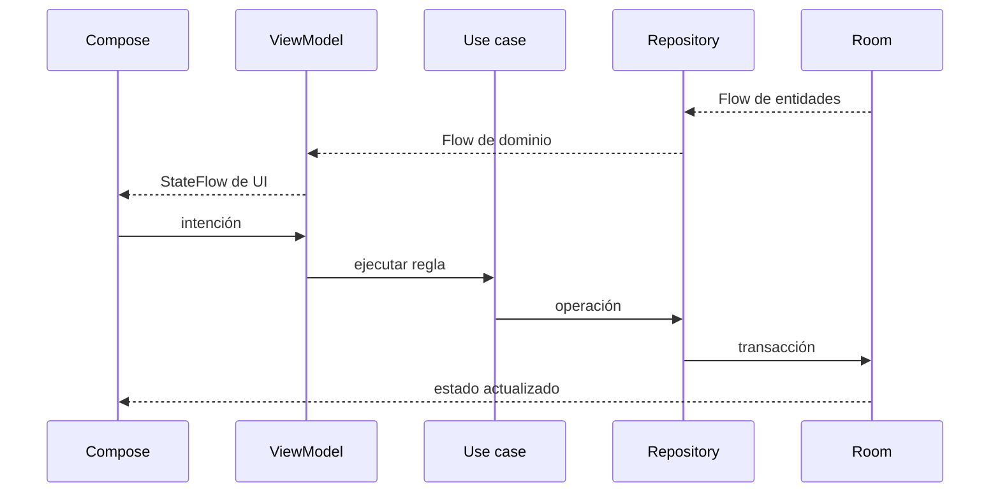
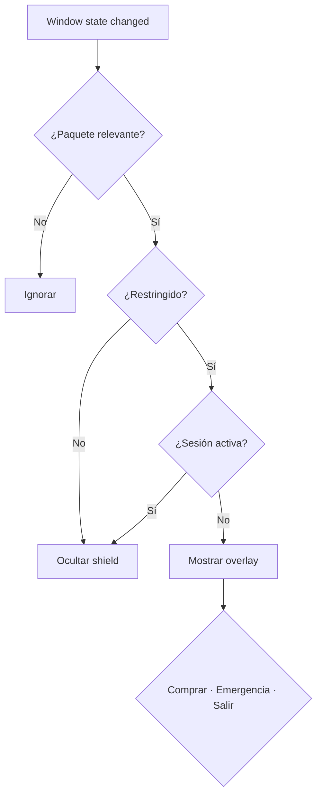

# Arquitectura

## Límites

```text
com.mushind.mind
├── core/       tiempo, IDs y design system
├── domain/     modelos, contratos y casos de uso puros
├── data/       Room, DataStore y PackageManager
├── platform/   accessibility, shield, workers y notificaciones
├── feature/    pantallas y ViewModels
├── navigation/ destinos Compose
└── di/         composición Hilt
```

Las dependencias apuntan al dominio. `domain` no conoce Composables, DAOs ni servicios Android. Compose envía intenciones al ViewModel y observa `StateFlow`; los repositorios transforman los `Flow` persistidos.

## Flujo de estado



La UI no decide si alcanza el saldo, si una sesión está activa ni si una regla es permisiva.

## Transacciones críticas

Al completar una tarea, Room lee tarea y progreso, ejecuta `CompleteTask`, cambia `PENDING → COMPLETED` de forma condicional, actualiza saldo/XP e inserta `TASK_REWARD`. Si falla el ledger, revierte también tarea y progreso.

Al comprar, una sola transacción lee saldo y sesión, valida el costo, descuenta condicionalmente, inserta `APP_UNLOCK` y crea o extiende `UnlockSession`. La serialización de escritura impide gastar el mismo saldo concurrentemente.

## Día lógico y trabajo diferido

`LogicalDayResolver` usa `Instant` y `ZoneId`; `ClockProvider` permite controlar el tiempo en pruebas. `ReconcileDays` cierra días omitidos, crea resúmenes idempotentes, expira sesiones, activa planes y aplica cambios pendientes.

WorkManager ejecuta una reconciliación al inicio, otra periódica cada 12 horas y el recordatorio diario. Su puntualidad no es requisito de corrección: el estado persistido se repara al abrir la aplicación.

## Protección Android



`AppRestrictionAccessibilityService` es un adaptador delgado: identifica el paquete, consulta el motor y presenta `ShieldState`. No recupera el árbol de accesibilidad ni contiene reglas financieras.

## Cambios protegidos

`CompareRuleStrictness` clasifica ediciones. Las estrictas/equivalentes se guardan; las permisivas exigen reto local y crean `PendingRuleChange` para el próximo día. La reconciliación lo aplica una vez. Debug usa una política corta; release exige más preguntas y tiempo.

## Persistencia

Room mantiene planes, tareas, progreso, ledger, reglas, sesiones, retos, cambios, emergencias y resúmenes. Sus esquemas versionados 1–5 y migraciones son explícitos. DataStore conserva recordatorio, apariencia y política de emergencia. No existe backend.

## Estrategia de pruebas

| Nivel | Responsabilidad |
|---|---|
| JVM | reglas puras, límites e idempotencia |
| Room instrumentado | atomicidad, rollback y concurrencia |
| Integración Android | DataStore y solicitudes WorkManager |
| UI | tareas, reglas, compra, apariencia y reto |
| Manual | accessibility, overlays, reinicio, fabricantes y modo avión |

Consulta el [checklist de release](RELEASE_CHECKLIST.md).
